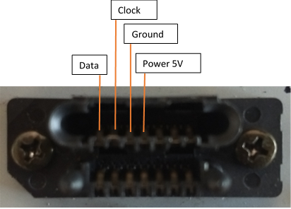
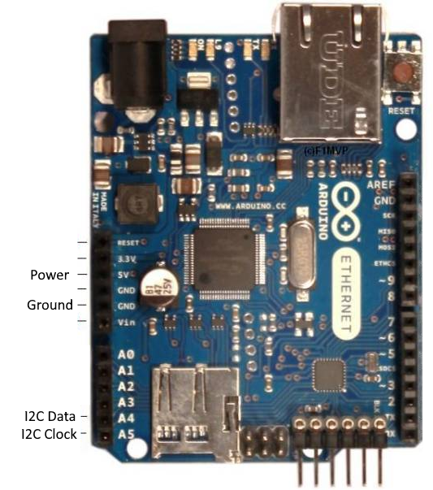

# CLP-510-transfer-belt-reset
Arduino code to reset page count on the Samsung CLP 510 printer's transfer belt

The Samsung CLP 510 printer as a planned obsolescence counter in the transfer belt EEPROM which stops the printer from functioning after about 50k pages have been printed. The user is then prompted to replace the transfer belt (which often costs as much as a whole new printer).

## What you need

- An Arduino board (I used an Arduino UNO, but any model will do).
- Wires
- A Samsung CLP-510 printer

## Steps

1. Remove the transfer belt from the printer
2. Locate the connector on the transfer belt.

The first 4 pins from top left are, in order:

I2C Data

I2C Clock

Ground

Power 5V

1. Get hold of an Arduino board. Locate the corresponding pins (Arduino UNO pictured below):

1. Connect the connector pins to the corresponding pins on the Arduino board. This can be a little tricky; I used just the wires that come with the Arduino board, but if that&#39;s too fiddly for you, you might prefer using some very small gator clips or alike.
2.

